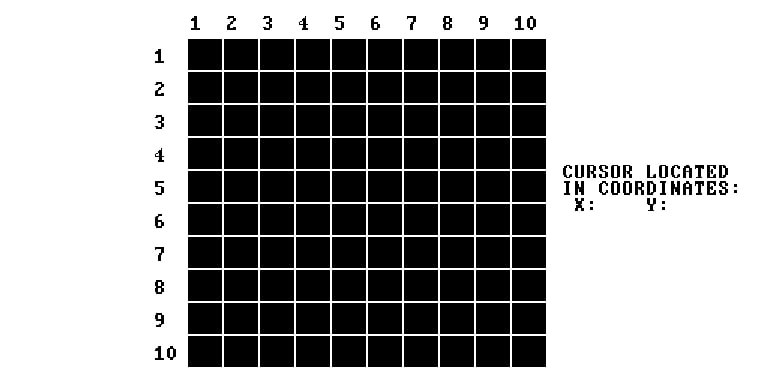
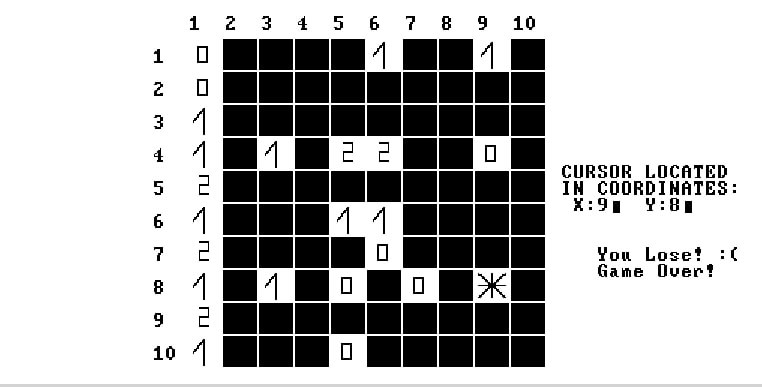
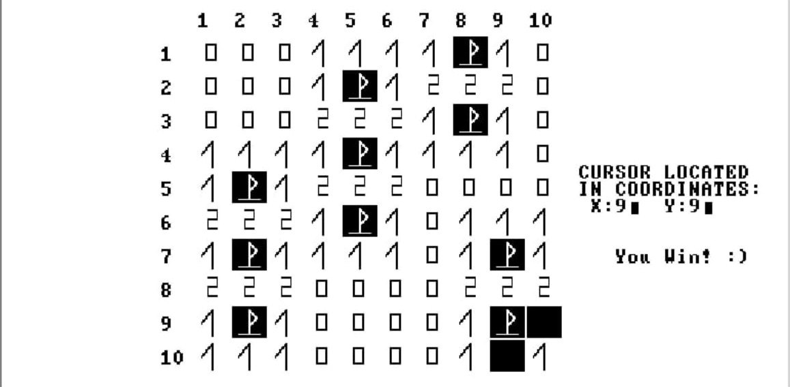

# Minesweeeper

**Minesweeeper** — реализация классической игры «Сапёр» на языке программирования Jack в.

## Оглавление

- [Описание](#описание)
- [Наши технологии и плюсы](#наши-технологии-и-плюсы)
- [Установка и запуск](#установка-и-запуск)
- [Скриншоты](#скриншоты)
- [Контакты](#контакты)

## Описание

Все любят играть в сапёра, так и зачем запускать его в гугле, когда можно запустить его лучшем языке программирования - Jack'е

Мы воплотили мечты в жизнь


## Наши технологии и плюсы

- реализован свой полностью аналог модуля Random. Расположение мин на поле зависит от того на какую кнопку вы нажали, и когда вы её нажали.
- отдельно прописан блок UI (очень красивый)
- полностью реализована оригинальная логика игры
- возможность менять количество мин в классе board (для любителей)

## Установка и запуск

1. **Клонирование репозитория:**

   ```bash
   git clone https://github.com/stepkagrigoriev/Minesweeeper.git

2. **Запуск:**
  Просто запускаете программу, дальше уже всё будет интуитивно понятно (но я всё равно опишу, как играть в сапёр)

**Сама игра происходит так**
1. Выбираете клетку, которую хотите открыть
2. Если в ней мина, то вы проиграли X﹏X
3. Если там не было мины, то в клетке появится число, которое показывает, сколько мин находится вокруг этой клетки
4. Если вы хотите отметить мину - ставьте флажок, клетку с флажком нельзя открыть до тех пор, пока вы этот флаг не уберёте
5. Игра заканчивается, когда вы открываете все клетки, не содержащие мины

## Скриншоты






## Контакты

Этих людей точно возьмут в гугл, благодаря этому проекту в портфолио:
- **Степан Григорьев** — [GitHub](https://github.com/stepkagrigoriev)  
- **Михайлов Иван** — [GitHub](https://github.com/profitist)
- **Сарнацкий Михаил** - [GitHub](https://github.com/sarnatskiy)
